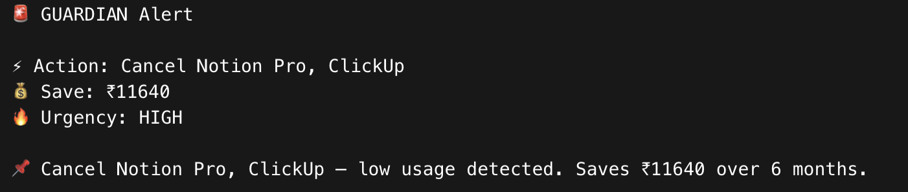

# guardian-
# 🛡️ GUARDIAN — Financial Decision System

An AI-powered financial co-pilot that detects wasteful spending and sends real-time alerts via Telegram.

---

## ❗ Problem

Most users pay for 3–5 subscriptions they barely use, leading to thousands in silent losses every year. Freelancers and individuals have no system to catch this automatically.

---

## ✅ Solution

GUARDIAN analyzes your transactions, identifies wasteful subscriptions, evaluates financial risk, and recommends clear actions — with instant Telegram alerts for high-priority decisions.

---

## 🎥 Demo


## 📸 Screenshots


### Dashboard


### Telegram Alert



---

## 🚀 Features

- AI-driven financial analysis using LangGraph multi-agent pipeline
- Smart subscription waste detection (usage + cost + redundancy)
- Iterative Analyst → Critic reasoning loop (REJECT → APPROVE)
- Real-time Telegram alerts for HIGH urgency decisions
- Interactive Streamlit dashboard with live reasoning trace

---

## 🧠 Tech Stack

| Layer | Technology |
|-------|-----------|
| Agent Framework | LangGraph |
| LLM (Analyst) | Claude 3 Haiku via OpenRouter |
| LLM (Critic) | GPT-4o Mini via OpenRouter |
| Frontend | Streamlit |
| Alerts | Telegram Bot API |
| Environment | Python-dotenv |

---

## 📊 Example Output

```
Action:   Cancel Notion Pro, ClickUp
Save:     ₹11,640 over 6 months
Urgency:  HIGH

→ Telegram alert triggered automatically
```

---

## 🏗️ Architecture

```
User Transactions
       ↓
   Monitor Agent
       ↓
  Analyst Agent  ←──────────┐
  (Claude Haiku)             │
       ↓                     │
   Critic Agent          REJECTED
   (GPT-4o Mini)             │
       ↓                     │
   APPROVED? ────────────────┘
       ↓
 Decision Engine
       ↓
Dashboard + Telegram Alert
```

---

## ⚙️ Setup

```bash
git clone https://github.com/yourusername/guardian
cd guardian
pip install -r requirements.txt
```

Create `.env` file:

```
OPENAI_API_KEY=your_openrouter_key
TELEGRAM_BOT_TOKEN=your_bot_token
TELEGRAM_CHAT_ID=your_chat_id
```

Run locally:

```bash
streamlit run dashboard.py
```

---

## 📁 Project Structure

```
guardian/
├── guardian_core.py       # LangGraph pipeline (agents + tools)
├── dashboard.py           # Streamlit UI
├── telegram_alert.py      # Telegram integration
├── requirements.txt
├── .env                   # secrets (never commit this)
├── assets/
│   ├── dashboard.png
│   └── telegram.png
└── README.md
```

---

## 🔮 Future Work

- CSV / PDF transaction upload
- Multi-user support with auth
- Spending trend analytics over time
- Bank API integration (Razorpay, Stripe)

---

## 👤 Built By

**Ganesh Kumar Reddy**
- GitHub: https://github.com/Ganeshreddy80
- LinkedIn: https://www.linkedin.com/in/a-ganesh-kumar-reddy-b00686379/
-# guardian-
